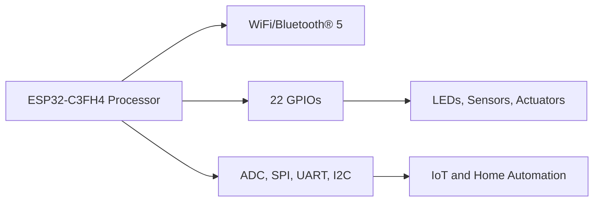

# **STEM Electronics & Python Programming Curriculum**

  
*Figure 1: DIY S.T.E.M Programming Learning Board by mr.niko.la*

---

## **Project Goal**

The goal of this project is to provide 1000s of students with their first electronic board, opening doors to the exciting world of electronics. We aim to:

- **🔋 Inspire Future Innovators**: Show students that electronics is a viable and rewarding career path.
- **🌍 Promote Diversity in STEM**: Highlight companies and founders from diverse backgrounds who are creating innovative gadgets within their communities.
- **🎓 Hands-On Learning**: Empower students with practical skills and knowledge through the DIY S.T.E.M Programming Learning Board, helping them build confidence and curiosity in the field of electronics.

We believe that by making electronics accessible and relatable, we can inspire the next generation of engineers, inventors, and problem-solvers.

---

## **Course Overview**
This 12-week course introduces high school students to Python programming and STEM electronics through hands-on projects using the DIY S.T.E.M Programming Learning Board by mr.niko.la. The course is designed to foster problem-solving skills, creativity, and practical knowledge in electronics and IoT.

### **Key Highlights**
- **🔍 Introduction to Python Programming**
  - Understand the basics of Python and its applications in STEM.
- **🔧 Hands-on Electronics Projects**
  - Use the mr.niko.la board for real-world IoT and automation projects.
- **🎓 Comprehensive Learning Experience**
  - Learn coding, electronics, and project development in one integrated course.

---

## **Weekly Breakdown**

| **Week** | **Lesson** | **Topic**                             | **Objectives**                         | **Activities**            |
|----------|------------|---------------------------------------|----------------------------------------|---------------------------|
| **1**    | 1          | Introduction to Python                | Overview of Python and its importance  | Discussion, Python install |
|          | 2          | Setting up the Development Environment | Install IDE and Python on PC           | Setup, explore Python IDE  |
| **2**    | 3          | Writing Your First Python Program     | Create and run a "Hello World" program | Write and execute code     |
|          | 4          | Variables and Data Types              | Understand variables, data types       | Hands-on coding            |
| **3**    | 5          | Conditional Statements                | Learn if-else conditions               | Practice through examples  |
|          | 6          | Loops (For & While)                   | Introduction to loops in Python        | Loop through lists         |
| **4**    | 7          | Working with Lists                    | Understanding lists and indexing       | List manipulation exercises|
|          | 8          | Dictionaries in Python                | Learn about key-value pairs            | Dictionary exercises       |
| **5**    | 9          | Functions and Modules                 | Create and use functions               | Modularize code            |
|          | 10         | Importing and Using Modules           | Work with Python modules               | Use libraries              |
| **6**    | 11         | Introduction to the STEM Board        | Overview of the STEM board features    | Explore the board          |
|          | 12         | GPIO Basics                           | Learn about General Purpose Input/Output | LED blink project       |
| **7**    | 13         | Sensors and Actuators                 | Integrating sensors with the board     | Sensor data collection     |
|          | 14         | Introduction to IoT                   | What is IoT? Understanding its significance | Discussion, explore IoT |
| **8**    | 15         | Wi-Fi and Bluetooth® Connectivity     | Connect the board to networks          | Network setup exercises    |
|          | 16         | Data Communication Protocols          | Learn about UART, I2C, SPI             | Protocol integration       |
| **9**    | 17         | IoT Project Planning                  | Plan the final IoT project             | Project proposal           |
|          | 18         | Initial Setup and Coding              | Start coding the IoT project           | Implement code             |
| **10**   | 19         | Testing and Debugging                 | Test and debug the project             | Troubleshoot issues        |
| **11**   | 20         | Project Presentation                  | Final project demonstration            | Present and review         |
| **12**   | *Review & Recap* | Course summary and feedback    | Review key concepts                    | Discussion, Q&A            |

---

## **DIY S.T.E.M Programming Learning Board by mr.niko.la**

### **Key Highlights**
- **Processor**: ESP32-C3FH4 for seamless electronics, coding, and robotics projects.
- **Connectivity**: WiFi/Bluetooth® 5, supports IoT and home automation.
- **GPIOs**: 22 GPIOs with ADC, SPI, UART, and I2C protocols for versatile connectivity.
- **Compatibility**: Works with Espressif's ESP-IDF, Arduino IDE, and leading Adafruit, Seed, SparkPlug ecosystems.

### **Overview**

**DIY S.T.E.M Programming Learning Board** &rarr; A versatile tool for STEM electronics and IoT projects.

*Voice Activated Light Bulb*

**Board Features:**
- **Processor**: ESP32-C3FH4 with WiFi/Bluetooth® 5
- **22 GPIOs**: Supports ADC, SPI, UART, I2C
- **Compatible IDEs**: Arduino IDE, ESP-IDF

### **Course Integration**
This course uses the DIY S.T.E.M Programming Learning Board to teach practical electronics and IoT concepts, culminating in a final project where students create their own IoT solution.

### Basic Arithmetic to Advanced Mathematical Concepts with Practical Lessons

$$
f(x) = x^2
$$

$$
g(x) = \frac{1}{x}
$$

$$
F(x) = \int_a^b \frac{1}{3}x^3 \, dx
$$

### **Diagram of Connectivity:**

### **About Kava and Nikola Labs**

### **Kava**
Kava, an electronic R&D researcher collaborating with the University of Windsor, specializes in developing PCB boards for electric two-wheeler platforms. Noticing a gap in STEM education, Kava developed the new DIY S.T.E.M Programming Learning Board to provide students with critical STEM lessons and hands-on experience.

In their lectures to university and college students, Kava has observed that the current curriculum often lacks modern tools and skills. To address this, Kava is working with the University of Windsor on an undergraduate STEM board design that offers practical, hands-on learning. Recognizing the potential to reach a wider audience, Kava aims to scale this initiative into an online remote platform capable of serving thousands of students each semester and fostering a vibrant community around the board.

### **Nikola Labs**

**Nikola Labs' Highlights:**

- **📊 4+ years** Univeristy R&D Lead Researcher focusing on Machine Learning with Hardware
- **💻 10+ years** of advanced PCB design, MEMS sensor consulting.
- **🔬 In-house R&D** through Nikola Labs' electrical engineering facility.
- **🤝 Collaboration** with University of Windsor, Gates Corp, and Automotice Parts Manufacturer Association 
- **🔌 IoT & Embedded Systems expertise.**

### **Nikola Labs’ Mission**
Nikola Labs is dedicated to advancing STEM education and supporting innovation through practical, hands-on learning tools. Our collaboration with educational institutions and industry leaders enables us to create cutting-edge solutions like the DIY S.T.E.M Programming Learning Board, designed to inspire the next generation of engineers and innovators.

