# **STEM Python Electronics Programming Board & Curriculum**

  
*Figure 1: DIY S.T.E.M Programming Learning Board by mr.niko.la*

---

## **Project Goal**

The goal of this project is to provide 1000s of students with their first electronic board, opening doors to the exciting world of electronics through Science, Technology, Engineering, and Math. We aim to:

- **🔋 Inspire Future Innovators**: Show students that electronics is a viable and rewarding career path.
- **🌍 Promote Diversity in STEM**: Highlight companies and founders from diverse backgrounds who are creating innovative gadgets within their communities.
- **🎓 Hands-On Learning**: Empower students with practical skills and knowledge through the DIY S.T.E.M Programming Learning Board, helping them build confidence and curiosity in the field of electronics.

We believe that by making electronics accessible and relatable, we can inspire the next generation of engineers, inventors, and problem-solvers.

---
# Our Partners

| Espressif | Digi-Key | Education | Join our partnership |
|:---------:|:--------:|:---------:|:--------------------:|
|  |  |  |  |

---
This comprehensive course introduces high school students to Python programming and STEM electronics through hands-on projects using the DIY S.T.E.M Programming Learning Board by mr.niko.la. The course is designed to foster problem-solving skills, creativity, and practical knowledge in electronics and IoT. Using AI, we create custom-curated unique lesson plans tailored to each student's individual interests and hobbies.

### **Key Highlights**
- **🔍 Introduction to Python Programming**
  - Understand the basics of Python and its applications in STEM.
- **🔧 Hands-on Electronics Projects**
  - Use the mr.niko.la board for real-world IoT and automation projects.
- **🎓 Comprehensive Learning Experience**
  - Learn coding, electronics, and project development in one integrated course.

---

## **Curriculum Structure**

### Part 1: Python Fundamentals (6 weeks)

| **Week** | **Topic**                             | **Objectives**                         |
|----------|---------------------------------------|----------------------------------------|
| **1**    | Introduction to Python                | Overview of Python and its importance  |
| **2**    | Variables, Data Types, and Operations | Understand basic Python syntax         |
| **3**    | Control Structures                    | Learn if-else conditions and loops     |
| **4**    | Functions and Modules                 | Create and use functions, import modules |
| **5**    | Data Structures                       | Work with lists, dictionaries, and tuples |
| **6**    | File Handling and Basic I/O           | Read from and write to files           |

### Part 2: STEM Applications (6 weeks)

| **Week** | **Focus Area** | **Topic**                             | **Objectives**                         |
|----------|----------------|---------------------------------------|----------------------------------------|
| **7**    | Science        | Data Collection and Analysis          | Use sensors to collect and analyze data |
| **8**    | Technology     | IoT and Connectivity                  | Implement WiFi/Bluetooth connectivity  |
| **9**    | Engineering    | Robotics and Automation               | Build simple robots and automate tasks |
| **10**   | Mathematics    | Data Visualization and Statistics     | Create graphs and perform basic stats  |
| **11-12**| Group Project  | Integrated STEM Project               | Design and implement a comprehensive project |

### Part 3: Advanced Projects and Demonstration (4 weeks)

| **Week** | **Focus Area** | **Topic**                             | **Objectives**                         |
|----------|----------------|---------------------------------------|----------------------------------------|
| **13-14**| Group Project  | Advanced STEM Project Development     | Apply all learned concepts to a complex project |
| **15**   | Testing and Refinement | Project Testing and Debugging | Conduct thorough testing and refine the project |
| **16**   | Demonstration  | Project Presentation and Demo         | Present and demonstrate the final project |

## **Course Overview**
## **DIY S.T.E.M Programming Learning Board by mr.niko.la**

### **Key Highlights**
- **Processor**: ESP32-C3FH4 for seamless electronics, coding, and robotics projects.
- **Connectivity**: WiFi/Bluetooth® 5, supports IoT and home automation.
- **GPIOs**: 22 GPIOs with ADC, SPI, UART, and I2C protocols for versatile connectivity.
- **Compatibility**: Works with Espressif's ESP-IDF, Arduino IDE, and leading Adafruit, Seed, SparkPlug ecosystems.

### **Overview**

**DIY S.T.E.M Programming Learning Board** &rarr; A versatile tool for STEM electronics and IoT projects.

*Voice Activated Light Bulb*

### **Course Integration**
This course uses the DIY S.T.E.M Programming Learning Board to teach practical electronics and IoT concepts, culminating in a final project where students create their own IoT solution.

### Basic Arithmetic to Advanced Mathematical Concepts with Practical Lessons

$$
f(x) = x^2
$$

$$
g(x) = \frac{1}{x}
$$

$$
F(x) = \int_a^b \frac{1}{3}x^3 \, dx
$$

### **Diagram of Connectivity:**

```mermaid
graph LR
    A[ESP32-C3FH4 Processor] --> B[WiFi/Bluetooth® 5]
    A --> C[22 GPIOs]
    A --> D[ADC, SPI, UART, I2C]
    C --> E[LEDs, Sensors, Actuators]
    D --> F[IoT and Home Automation]
```

---

## **About Kava and Nikola Labs**

### **Kava**
Kava, an electronic R&D researcher collaborating with the University of Windsor, specializes in developing PCB boards for electric two-wheeler platforms. Kava is the lead designer of a 2-wheeler electric automotive platform designed for smart cities as a heavy-duty work bike for commercial applications. 

Kava designed the:
- Advanced embedded electronics
- Custom-designed speed controller
- Electronic motor
- RISC-V based infotainment system

For more information about the bike project, visit: [https://github.com/Niko-La/bike-repo](https://github.com/Niko-La/bike-repo)

While working closely with the university, professors, and students, Kava noticed a gap in STEM education and developed the new DIY S.T.E.M Programming Learning Board to provide students with critical STEM lessons and hands-on experience.

### **Nikola Labs**

**Nikola Labs' Highlights:**

- **📊 4+ years** University R&D Lead Researcher focusing on Machine Learning with Hardware
- **💻 10+ years** of advanced PCB design, MEMS sensor consulting.
- **🔬 In-house R&D** through Nikola Labs' electrical engineering facility.
- **🤝 Collaboration** with University of Windsor, Gates Corp, and Automotive Parts Manufacturer Association 
- **🔌 IoT & Embedded Systems expertise.**

### **Nikola Labs' Mission**
Nikola Labs is dedicated to advancing STEM education and supporting innovation through practical, hands-on learning tools. Our collaboration with educational institutions and industry leaders enables us to create cutting-edge solutions like the DIY S.T.E.M Programming Learning Board, designed to inspire the next generation of engineers and innovators.

---

## **Collaboration with University of Windsor**

Our collaboration with the University of Windsor's Electrical & Computer Engineering Department and their BMS Lab offers several benefits:

- Practical, hands-on learning for required lab work
- Access to cutting-edge research and development in STEM fields
- Opportunity for students to work with industry-standard tools and technologies
- Potential for internships and research opportunities for promising students
- Bridge between academic learning and real-world applications

### **Benefits of the Program**

For Students:
- Gain practical, hands-on experience with real-world electronics and programming
- Develop problem-solving and critical thinking skills
- Explore potential career paths in STEM fields
- Build a portfolio of projects for future academic or job applications
- Connect with like-minded peers and potential mentors

For Parents:
- Invest in their child's future with a high-quality, practical STEM education
- See tangible results of their child's learning through completed projects
- Potential for improved academic performance in related subjects
- Prepare their children for future career opportunities in high-demand fields

For the Community:
- Foster a culture of innovation and technological literacy
- Prepare the next generation of local tech talent
- Potential for increased economic development through a skilled workforce
- Bridge the gap between education and industry needs

### **Unique Offering**
Our program is the first of its kind to offer a comprehensive, online-focused tool for STEM education in our community. By combining hands-on learning with digital resources, we're creating a scalable, accessible platform that can reach thousands of students each semester.

---

## **Seeking Education Partners**

We are **seeking education partners** interested in incorporating the Nikola STEM Board into their programs. For long-term partners with commitments of **over 1,000 units**, we offer a **customized board** and **tailored lesson plans**. This is a **great opportunity** to enhance your STEM curriculum with **hands-on, practical tools**.

If your institution is interested, please **contact us** to discuss how we can collaborate to bring innovative STEM education to your students:

**Email:** [STEM@niko.la](mailto:STEM@niko.la)

---

*World's first board fully designed, manufactured, and assembled in South India 🇮🇳🤝🇨🇦*
